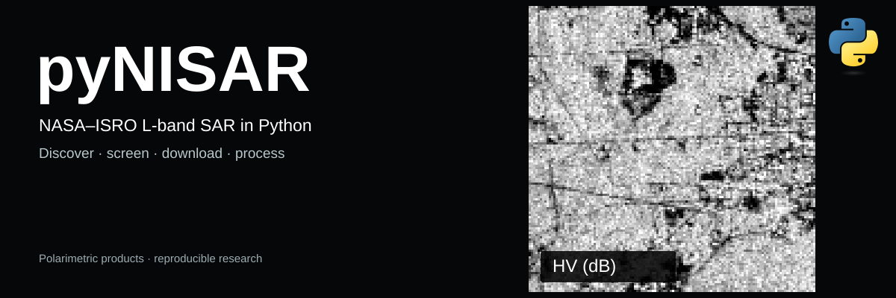
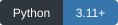
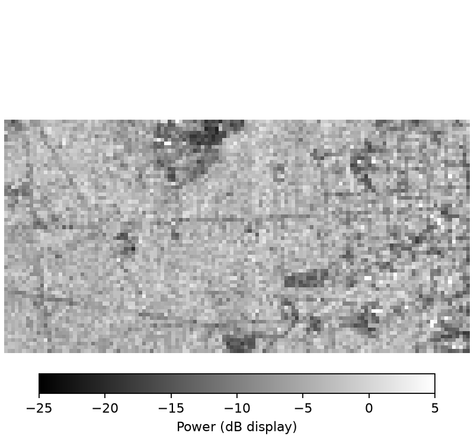
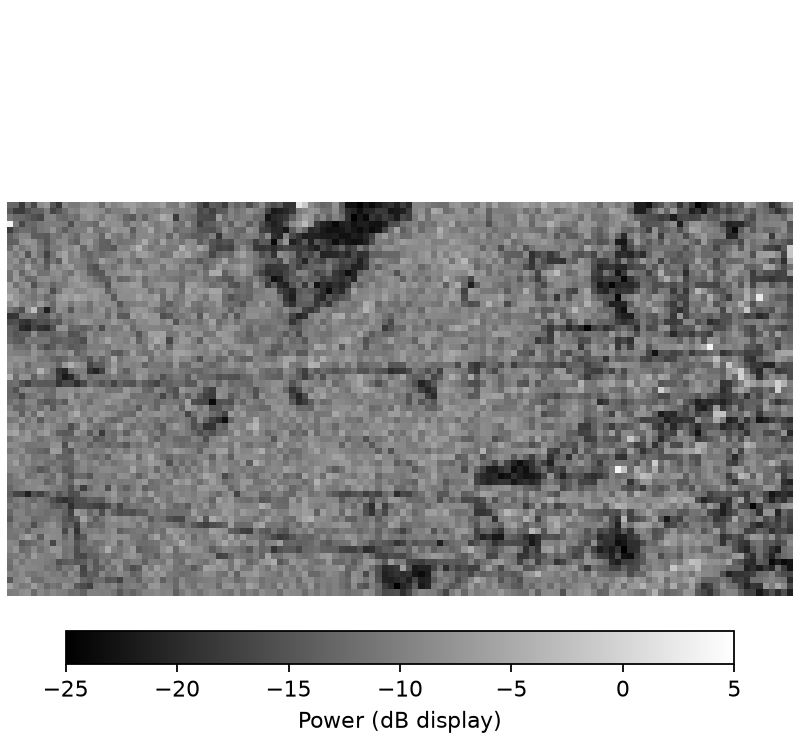
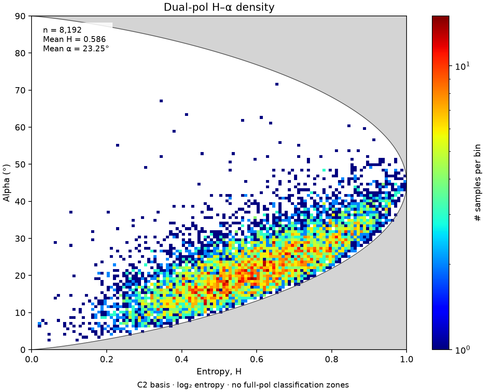
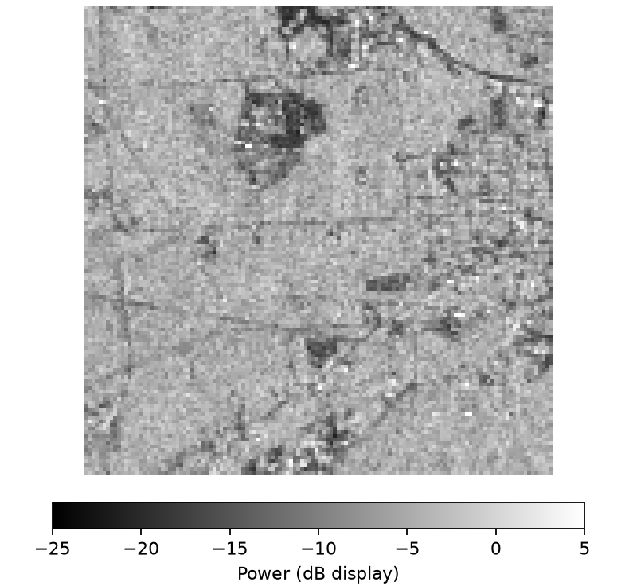
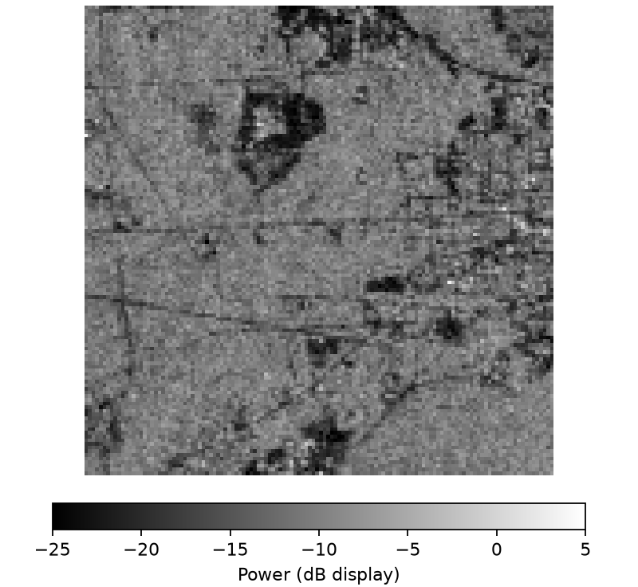
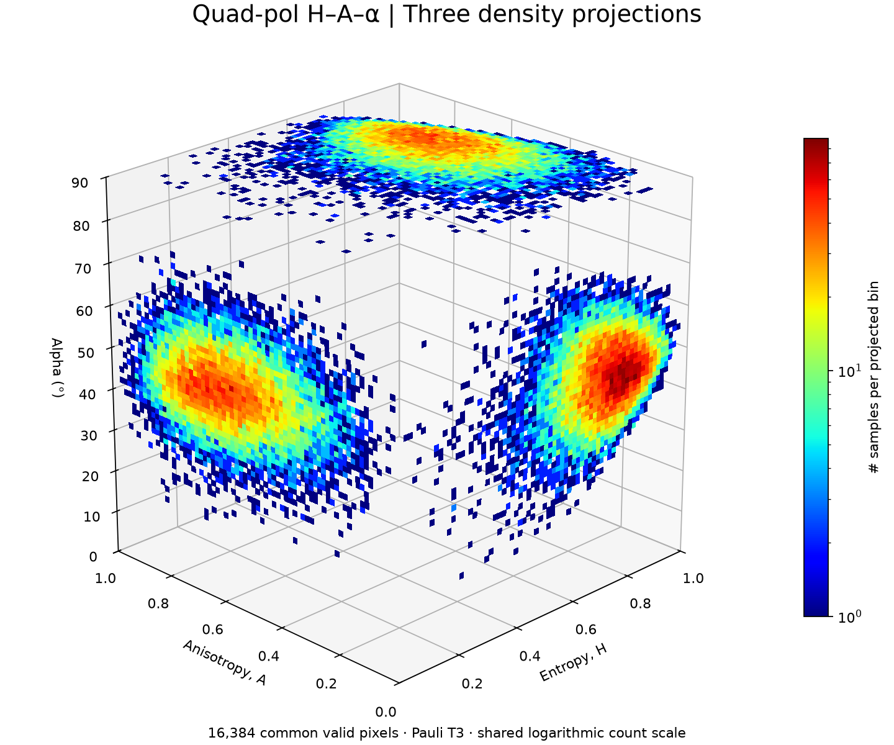
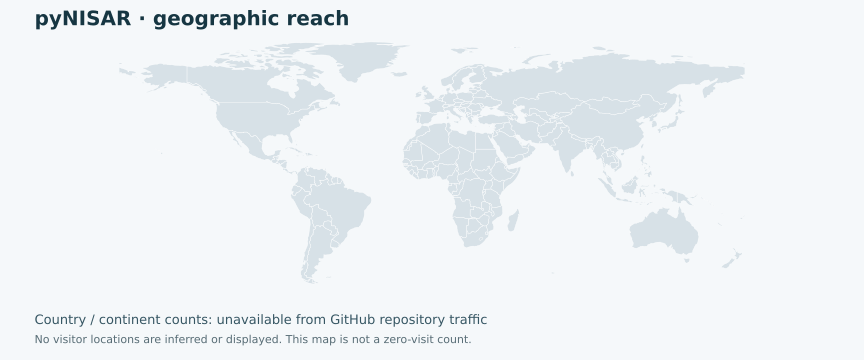

<p align="center"></p>

<p align="center">
<a href="https://www.python.org/"></a>
<a href="https://book.cryointhecloud.com/"></a>
<a href="LICENSE"></a>
<a href="https://github.com/Cesarito2021/pyNISAR/archive/refs/heads/main.zip"></a>
</p>

# pyNISAR: a Python library for accessing, screening, processing and downloading NASA–ISRO SAR data

**Author:** Cesar Alvites — University of Florida, School of Forest, Fisheries, and Geomatics Sciences.

pyNISAR searches NISAR observations, inspects HDF5 products, reads or downloads
selected data, and generates cross-polarization and polarimetric products for
applications such as forest monitoring. This research library focuses on **L-band
GSLC, GCOV and RSLC**, using code developed for [PyGeoObserver](https://github.com/Cesarito2021/pygeoobserver).

## Configuration and account credentials

| Requirement | Configuration |
|---|---|
| Python | 3.11 or newer; local Jupyter, Colab or CryoCloud. |
| Source access | This repository is **private**; GitHub permission is required to download it. No PyPI release yet. |
| NASA credentials | Your own [Earthdata Login](https://urs.earthdata.nasa.gov/) for protected reads/downloads. Search and bundled examples need no login. |
| Study area | WGS84 box, GeoJSON or a GeoPackage polygon layer. |
| Storage | Choose a local/notebook output folder. Whole HDF5 scenes may occupy several GB; bounded remote reads avoid saving a complete scene. |

## Get started

Download and extract the source ZIP, then install from its folder:

```bash
python -m pip install ".[plot,discovery,notebook]"
```

The measured examples run immediately without NASA credentials:

```python
import pynisar
run = pynisar.process_sample("outputs", mode="dual")  # Or mode="quad".
figures = pynisar.plot_gallery(run)
```

**Colab:** download a notebook below and the source ZIP; open the notebook in Colab.
Its installation cell accepts the source ZIP if pyNISAR is not installed.
**Jupyter/CryoCloud:** install from the extracted source, then open the `.ipynb`.
[Notebook instructions](docs/NOTEBOOKS.md).

## Introduction

[NASA–ISRO Synthetic Aperture Radar (NISAR)](https://science.nasa.gov/mission/nisar/)
uses L- and S-band radar to observe changes in land, vegetation, water and ice.
Launched on 30 July 2025, it supports ecosystem monitoring and studies of surface
change. pyNISAR currently processes the mission's **L-band** products.

Data-release status, checked **27 September 2026**:

- **23 January 2026:** initial pre-calibration sample products, Levels 1–3.
- **27 February 2026:** broader **BETA** release, not fully calibrated.
- **20 July 2026:** calibrated, partially validated **PROVISIONAL** products,
  Levels 0–3; routine acquisitions from 17 June 2026 plus selected earlier time series.
- **Planned for Q4 2026:** validated products and reprocessing of the science-phase
  backlog; this remains a schedule, not a completed release.

See the [NASA/ASF availability guide](https://nisar-docs.asf.alaska.edu/availability-overview/)
for updates. Avoid treating BETA and PROVISIONAL products as interchangeable.

## Input and output data

| Case | Input | Products | Figures |
|---|---|---|---|
| Dual polarization | HH/HV or VV/VH in GSLC/GCOV/RSLC; complex cross terms needed for phase descriptors | Measured powers, intensity ratios, supported H, α, DoP and related descriptors; GeoTIFF, CSV, manifest | Power maps and H–α density |
| Quad polarization | Measured HH/HV/VH/VV and complete complex covariance; explicit reciprocity assumption | Supported 18-layer profile, including H, A, α, span and Pauli powers; GeoTIFF, CSV, manifest | Power maps and H–A–α diagram |

Missing phase information is never reconstructed from intensity alone. RSLC
remains in radar geometry. Small-window runs also save covariance; chunked runs
avoid this extra storage. [Product definitions](docs/POLARIMETRY.md).

## Dual-polarization case

[](https://colab.research.google.com/github/Cesarito2021/pyNISAR/blob/main/examples/pyNISAR_dual.ipynb) [](https://github.com/Cesarito2021/pyNISAR/raw/refs/heads/main/examples/pyNISAR_dual.ipynb)

Run steps in order. **`LIVE=False` reproduces the measured bundled subset**;
`LIVE=True` enables NASA access. The full notebook includes whole-HDF5 download
and alternative-AOI options. Private Colab links require repository access; if
Colab cannot open the link, download the notebook and use **File → Upload notebook**.

**Step 1 — Import libraries.**

```python
from pathlib import Path
import earthaccess
import pynisar
from pynisar.discovery import collections, search
from IPython.display import display, HTML
import base64
```

**Step 2 — Define the study area.**

```python
LIVE = False  # False: bundled measured data; True: NASA search and processing.
area = {"bbox": (-90.215, 46.435, -90.185, 46.465)}
# Or: area = {"aoi": "study_area.geojson"}
# Or: area = {"aoi": "study_area.gpkg", "layer": "boundary"}
dates = {"start": "2025-11-06", "end": "2025-11-07"}
if "aoi" in area:
    from pynisar.aoi import read_aoi
    point = read_aoi(area["aoi"], layer=area.get("layer")).geometry.union_all().representative_point()
    center = (point.x, point.y)
else:
    w, s, e, n = area["bbox"]
    center = ((w + e) / 2, (s + n) / 2)
```

**Step 3 — Sign in to Earthdata.**

```python
if LIVE:
    auth = earthaccess.login(persist=False)
    if not auth.authenticated:
        raise RuntimeError("Sign in with your own NASA Earthdata account.")
```

**Step 4 — Search NISAR.**

```python
if LIVE:
    choices = [c for c in collections() if "GSLC" in c["short_name"] and "PROVISIONAL" in c["short_name"]]
    if not choices:
        raise RuntimeError("No provisional GSLC collection found. Inspect collections().")
    scenes = search(choices[0]["concept_id"], **area, **dates, count=50)
    reference = Path(pynisar.sample("dual").info["source"]).stem
    scene = next((s for s in scenes if reference in s["umm"]["GranuleUR"]), None)
    if scene is None:
        candidates = [s for s in scenes if "_QP" in s["umm"]["GranuleUR"]]
        if not candidates:
            raise RuntimeError("No candidate quad acquisition found. Change the AOI/dates or inspect scenes for another polarization.")
        scene = candidates[0]
    print(scene["umm"]["GranuleUR"])
```

**Step 5 — Generate polarimetric products.**

```python
settings = {"channels": ['HH', 'HV'], "looks": (4, 2)}
if LIVE:
    url = next(u for u in scene.data_links() if u.split("?")[0].endswith(".h5"))
    with pynisar.open_remote(url, max_mb=256) as source:
        run = pynisar.process(source, "outputs/dual", **settings,
                             center=center, window_size=256)
else:
    run = pynisar.process_sample("outputs/dual", mode="dual")
```

**Step 6 — Plot the results.**

```python
figures = pynisar.plot_gallery(run)
images = "".join('' for p in figures)
display(HTML(images))
```

**Measured result:** HH/HV selected from a quad GSLC acquisition, 6 November
2025, western Great Lakes. Power is uncorrected mean |S|²; H–α uses the dual C2 basis.

<table><tr>
<td width="33%" align="center"><strong>HH</strong><br></td>
<td width="33%" align="center"><strong>HV</strong><br></td>
<td width="33%" align="center"><strong>H–α · 2D</strong><br></td>
</tr></table>

## Quad-polarization case

[](https://colab.research.google.com/github/Cesarito2021/pyNISAR/blob/main/examples/pyNISAR_quad.ipynb) [](https://github.com/Cesarito2021/pyNISAR/raw/refs/heads/main/examples/pyNISAR_quad.ipynb)

Run steps in order. **`LIVE=False` reproduces the measured bundled subset**;
`LIVE=True` enables NASA access. The full notebook includes whole-HDF5 download
and alternative-AOI options. Private Colab links require repository access; if
Colab cannot open the link, download the notebook and use **File → Upload notebook**.

**Step 1 — Import libraries.**

```python
from pathlib import Path
import earthaccess
import pynisar
from pynisar.discovery import collections, search
from IPython.display import display, HTML
import base64
```

**Step 2 — Define the study area.**

```python
LIVE = False  # False: bundled measured data; True: NASA search and processing.
area = {"bbox": (-90.215, 46.435, -90.185, 46.465)}
# Or: area = {"aoi": "study_area.geojson"}
# Or: area = {"aoi": "study_area.gpkg", "layer": "boundary"}
dates = {"start": "2025-11-06", "end": "2025-11-07"}
if "aoi" in area:
    from pynisar.aoi import read_aoi
    point = read_aoi(area["aoi"], layer=area.get("layer")).geometry.union_all().representative_point()
    center = (point.x, point.y)
else:
    w, s, e, n = area["bbox"]
    center = ((w + e) / 2, (s + n) / 2)
```

**Step 3 — Sign in to Earthdata.**

```python
if LIVE:
    auth = earthaccess.login(persist=False)
    if not auth.authenticated:
        raise RuntimeError("Sign in with your own NASA Earthdata account.")
```

**Step 4 — Search NISAR.**

```python
if LIVE:
    choices = [c for c in collections() if "GCOV" in c["short_name"] and "PROVISIONAL" in c["short_name"]]
    if not choices:
        raise RuntimeError("No provisional GCOV collection found. Inspect collections().")
    scenes = search(choices[0]["concept_id"], **area, **dates, count=50)
    reference = Path(pynisar.sample("quad").info["source"]).stem
    scene = next((s for s in scenes if reference in s["umm"]["GranuleUR"]), None)
    if scene is None:
        candidates = [s for s in scenes if "_QP" in s["umm"]["GranuleUR"]]
        if not candidates:
            raise RuntimeError("No candidate quad acquisition found. Change the AOI/dates or inspect scenes for another polarization.")
        scene = candidates[0]
    print(scene["umm"]["GranuleUR"])
```

**Step 5 — Generate polarimetric products.**

```python
settings = {"channels": ['HH', 'HV', 'VH', 'VV'], "looks": (1, 1)}
settings["reciprocal"] = True
if LIVE:
    url = next(u for u in scene.data_links() if u.split("?")[0].endswith(".h5"))
    with pynisar.open_remote(url, max_mb=256) as source:
        run = pynisar.process(source, "outputs/quad", **settings,
                             center=center, window_size=128)
else:
    run = pynisar.process_sample("outputs/quad", mode="quad")
```

**Step 6 — Plot the results.**

```python
figures = pynisar.plot_gallery(run)
images = "".join('' for p in figures)
display(HTML(images))
```

**Measured result:** four-channel GCOV from the same Great Lakes acquisition.
Power is used as stored (nominal γ⁰); H–A–α uses reciprocal Pauli T3.
These examples are separate from the manuscript’s Amazon–Cerrado study area.

<table><tr>
<td width="33%" align="center"><strong>HH</strong><br></td>
<td width="33%" align="center"><strong>HV</strong><br></td>
<td width="33%" align="center"><strong>H–A–α · 3D</strong><br></td>
</tr></table>

The README live example uses a small window at the AOI center; it is not an
AOI mask. The notebook computes the center for a supplied AOI. Bundled mode always
uses its recorded footprint and looks. [Source records](docs/figures/panels/sources.json).

For a downloaded HDF5, use `process_tile(..., scope="aoi", **area)` for masked
products or `scope="tile"` for the entire tile. `process_batch(..., workers=1)`
processes several files in chunks; optional `delete_source=True` removes each
HDF5 only after successful export. Finish source-based previews before cleanup.
[Batch, parallelism and storage](docs/BATCH.md).

## Acknowledgments

This study was supported by NASA’s Carbon Monitoring System (CMS,
**80NSSC23K1257**), Commercial SmallSat Data Scientific Analysis (CSDSA,
**80NSSC24K0055**), and ICESat-2 (**80NSSC23K0941**); the National Science
Foundation’s OpenForest4D project (**Award 2409886**); the Joint Fire Science
Program (**22-2-02-15**, *EMS4D: Multi-Scale Fuel Mapping and Decision Support
System for the Next Generation of Fire Management*); and the McIntire–Stennis
Program at the University of Florida (**Accession 7005758**).

Cesar Alvites thanks **CryoCloud** for access to its Python/Jupyter environment,
supported by NASA grants **80NSSC22K1877** and **80NSSC23K0002**. Manuscript
processing was performed in **Google Colab**.
[CryoCloud acknowledgment guidance](https://book.cryointhecloud.com/citing-cryocloud).

## Reporting issues

Please report pyNISAR issues to postdoctoral fellow **Cesar Alvites** at
[c.alvitediaz@ufl.edu](mailto:c.alvitediaz@ufl.edu), or open a
[GitHub issue](https://github.com/Cesarito2021/pyNISAR/issues).

## Citation

Alvites et al. *Early assessment of NISAR L-band SAR and multi-sensor fusion for
aboveground carbon mapping in the Brazilian Amazon–Cerrado ecotone.*
**Remote Sensing Applications: Society and Environment (under review).**
Not yet published; no publication DOI is assigned.
[Full author list and software citation](CITATION.cff).

## Disclaimer

pyNISAR is provided as research software without warranties of accuracy,
fitness for a particular purpose, or uninterrupted operation. Users are
responsible for assessing its suitability and validating their results. To the
extent permitted by applicable law, the authors are not liable for loss or damage
arising from its use. pyNISAR is not an official NASA or ISRO software product.

## License

**GNU General Public License v3.0 only (GPL-3.0-only)**, matching PyGeoObserver.
See [LICENSE](LICENSE) for the terms and [provenance](docs/PROVENANCE.md) for credits.

## Geographic reach



GitHub does not provide country/continent visitor or download statistics.
External image counters are not reliable geographic trackers on GitHub because
images are proxied. The map therefore shows **no inferred locations**.
[Current repository traffic](https://github.com/Cesarito2021/pyNISAR/graphs/traffic) ·
[Recorded totals and limitations](docs/TRAFFIC.md).
