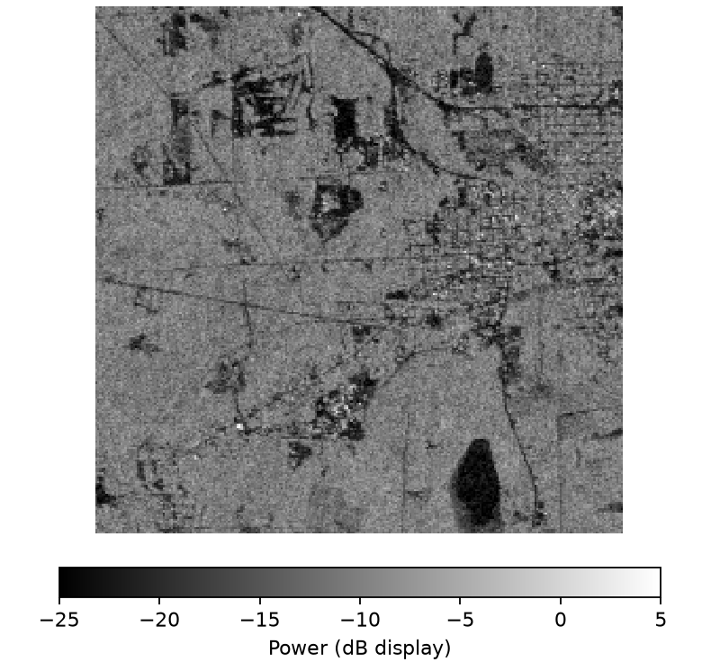
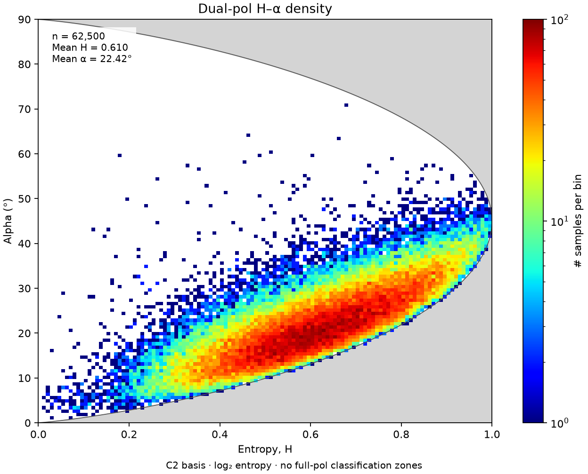
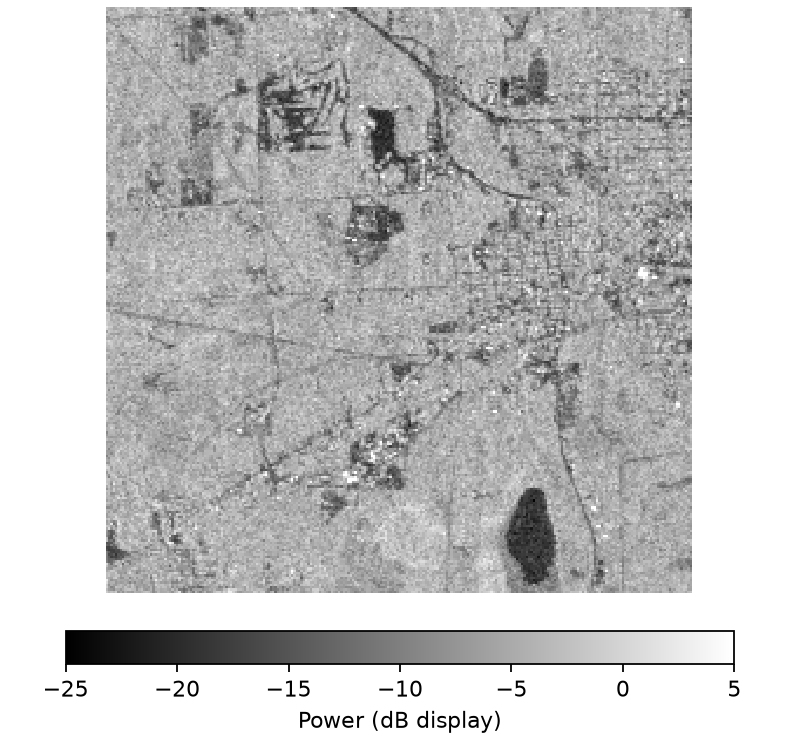
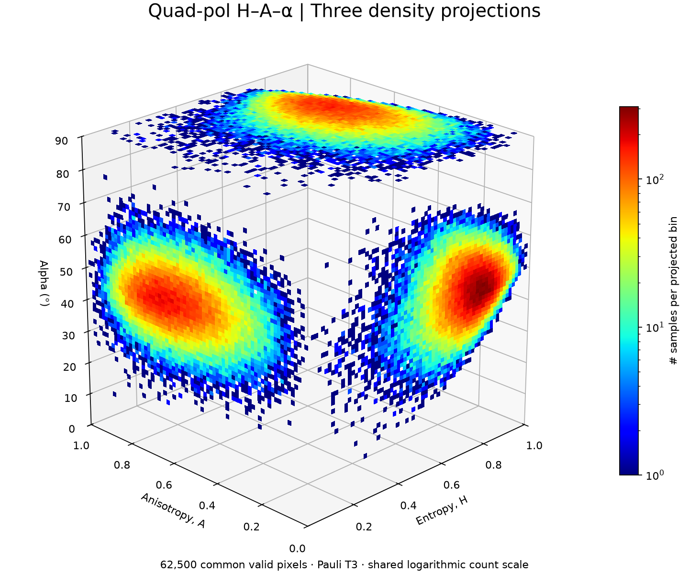

<p align="center"></p>

<p align="center">
<a href="https://www.python.org/"></a>
<a href="https://book.cryointhecloud.com/"></a>
<a href="LICENSE"></a>
<a href="https://github.com/Cesarito2021/pyNISAR/archive/refs/heads/main.zip"></a>
</p>

# pyNISAR: a Python library for accessing, screening, processing and downloading NASA–ISRO SAR data

**Research alpha — 0.1.0a1.** APIs may change. Please report installation or processing issues; the related manuscript remains **under review**.

**Author:** Cesar Alvites — University of Florida, School of Forest, Fisheries, and Geomatics Sciences.

pyNISAR searches NISAR observations, inspects HDF5 products, reads or downloads
selected data, and generates cross-polarization and polarimetric products for
applications such as forest monitoring. This research library focuses on **L-band
GSLC, GCOV and RSLC**.

Its focus is a guided NISAR workflow: **define an area → search observations →
access or download data → generate polarimetric products → export maps and figures**.
This integrates data access and processing around established polarimetric methods.

## Configuration and account credentials

| Requirement | Configuration |
|---|---|
| Python | 3.11 or newer; local Jupyter, Colab or CryoCloud. |
| Source access | Public source on GitHub; alpha distribution on PyPI. |
| NASA credentials | Your own [Earthdata Login](https://urs.earthdata.nasa.gov/) for protected reads/downloads. Search and bundled examples need no login. |
| Study area | WGS84 box, GeoJSON or a GeoPackage polygon layer. |
| Storage | Choose a local/notebook output folder. Whole HDF5 scenes may occupy several GB; bounded remote reads avoid saving a complete scene. |

## Get started

### Install pyNISAR

Install the alpha release with Python 3.11 or newer:

```bash
python -m pip install pyNISAR==0.1.0a1
```

In Jupyter, Colab or CryoCloud:

```python
%pip install pyNISAR==0.1.0a1
```

For the development version (Git required):

```bash
python -m pip install "pyNISAR @ git+https://github.com/Cesarito2021/pyNISAR.git"
```

### Import and use pyNISAR

The package is named **pyNISAR**; its Python import is lowercase: `pynisar`.
This small bundled example uses measured data and requires no NASA login:

```python
import pynisar
run = pynisar.process_sample("outputs", mode="dual")  # Or mode="quad".
figures = pynisar.plot_gallery(run)
```

After installation, copy the cells below into a notebook.
The [downloadable notebooks](https://github.com/Cesarito2021/pyNISAR/tree/main/examples) contain the same processing steps and
real CryoCloud outputs. If needed,
download the notebook and choose **File → Upload notebook** in Colab.
[Notebook setup](docs/NOTEBOOKS.md).

## Introduction

[NASA–ISRO Synthetic Aperture Radar (NISAR)](https://science.nasa.gov/mission/nisar/)
uses L- and S-band radar to observe changes in land, vegetation, water and ice.
Launched on 30 July 2025, it supports ecosystem monitoring and studies of surface
change. pyNISAR currently processes the mission's **L-band** products.

Data-release status, checked **27 September 2026**:

- **23 January 2026:** initial pre-calibration sample products, Levels 1–3.
- **27 February 2026:** broader **BETA** release, not fully calibrated.
- **20 July 2026:** calibrated, partially validated **PROVISIONAL** products,
  Levels 0–3; routine acquisitions from 17 June 2026 plus selected earlier time series.
- **Planned for Q4 2026:** validated products and reprocessing of the science-phase
  backlog; this remains a schedule, not a completed release.

See the [NASA/ASF availability guide](https://nisar-docs.asf.alaska.edu/availability-overview/)
for updates. Avoid treating BETA and PROVISIONAL products as interchangeable.

## Input and output data

| Case | Input | Products | Figures |
|---|---|---|---|
| Dual polarization | HH/HV or VV/VH in GSLC/GCOV/RSLC; complex cross terms needed for phase descriptors | Measured powers, intensity ratios, supported H, α, DoP and related descriptors; GeoTIFF, CSV, manifest | Power maps and H–α density |
| Quad polarization | Measured HH/HV/VH/VV and complete complex covariance; explicit reciprocity assumption | Supported 18-layer profile, including H, A, α, span and Pauli powers; GeoTIFF, CSV, manifest | Power maps and H–A–α diagram |

Missing phase information is never reconstructed from intensity alone. RSLC
remains in radar geometry. Small-window runs also save covariance; chunked runs
avoid this extra storage. [Product definitions](docs/POLARIMETRY.md).

## Dual-polarization case

[](https://colab.research.google.com/github/Cesarito2021/pyNISAR/blob/main/examples/pyNISAR_dual.ipynb) [](https://github.com/Cesarito2021/pyNISAR/raw/refs/heads/main/examples/pyNISAR_dual.ipynb)

Run the cells in order after installation. These results were generated in
CryoCloud on 28 September 2026 for a 5 × 5 km Great Lakes square.
The dual example selects HH/HV from a quad GCOV acquisition.

**Step 1 — Import libraries.**

```python
import earthaccess
import pynisar
import pandas as pd
from IPython.display import display, Image
```

**Step 2 — Define the study area.** Create a 5 × 5 km square; coordinates are longitude, latitude.

```python
area = pynisar.square_aoi(-90.2, 46.45, size_km=5)
area.to_file("study_area.geojson", driver="GeoJSON")
area
```

**Step 3 — Sign in to NASA Earthdata.** Use your own NASA account.

```python
auth = earthaccess.login(persist=False)
print("NASA login successful:", auth.authenticated)
```

**Step 4 — Search NISAR.** Show up to six matching scenes.

```python
scenes = pynisar.find_scenes(
    product="GCOV", aoi=area,
    start="2025-11-06", end="2025-11-18",
    polarization="quad",
)
pynisar.scene_table(scenes).head(6)
```

Recorded search: **two scenes**, acquired on 6 and 18 November 2025.
Row 0 is the 6 November acquisition. The notebook retains the actual table.

**Step 5 — Map the results.** Orange marks the study area; numbers match the table rows.

```python
search_map = pynisar.plot_search(scenes, area)
search_map.savefig("search_map.png", dpi=160)
search_map
```

**Step 6 — Select one scene.** Choose row 0. Only that observation will be processed.

```python
scene = scenes[0]
pynisar.scene_table([scene])
```

**Step 7 — Generate products.** Read and mask the AOI, with a 512 MiB transfer limit. No complete HDF5 is saved.

```python
run = pynisar.process_scene(
    scene, "outputs/dual",
    aoi=area, channels=["HH", "HV"],
    max_mb=512,
)
print("Products saved in:", run)
```

**Step 8 — Inspect the outputs.** GeoTIFFs, CSV statistics and a manifest are saved in the output folder.

```python
statistics = pd.read_csv(run / "statistics.csv")
statistics.head(6)
```

**Step 9 — Show the figures.** Display HH, HV and the polarimetric diagram.

```python
figures = pynisar.plot_gallery(run)
display(Image(filename=str(figures[0])))
display(Image(filename=str(figures[1])))
display(Image(filename=str(figures[2])))
```

**Recorded result:** 18 metric layers and 62,500 valid AOI pixels; GCOV power
is used as stored (nominal γ⁰). Figures below are from this execution.

<table><tr>
<td width="33%" align="center"><strong>HH</strong><br></td>
<td width="33%" align="center"><strong>HV</strong><br></td>
<td width="33%" align="center"><strong>H–α</strong><br></td>
</tr></table>

## Quad-polarization case

[](https://colab.research.google.com/github/Cesarito2021/pyNISAR/blob/main/examples/pyNISAR_quad.ipynb) [](https://github.com/Cesarito2021/pyNISAR/raw/refs/heads/main/examples/pyNISAR_quad.ipynb)

Run the cells in order after installation. These results were generated in
CryoCloud on 28 September 2026 for a 5 × 5 km Great Lakes square.
The quad example uses all four channels from the same GCOV acquisition and
explicitly assumes reciprocity.

**Step 1 — Import libraries.**

```python
import earthaccess
import pynisar
import pandas as pd
from IPython.display import display, Image
```

**Step 2 — Define the study area.** Create a 5 × 5 km square; coordinates are longitude, latitude.

```python
area = pynisar.square_aoi(-90.2, 46.45, size_km=5)
area.to_file("study_area.geojson", driver="GeoJSON")
area
```

**Step 3 — Sign in to NASA Earthdata.** Use your own NASA account.

```python
auth = earthaccess.login(persist=False)
print("NASA login successful:", auth.authenticated)
```

**Step 4 — Search NISAR.** Show up to six matching scenes.

```python
scenes = pynisar.find_scenes(
    product="GCOV", aoi=area,
    start="2025-11-06", end="2025-11-18",
    polarization="quad",
)
pynisar.scene_table(scenes).head(6)
```

Recorded search: **two scenes**, acquired on 6 and 18 November 2025.
Row 0 is the 6 November acquisition. The notebook retains the actual table.

**Step 5 — Map the results.** Orange marks the study area; numbers match the table rows.

```python
search_map = pynisar.plot_search(scenes, area)
search_map.savefig("search_map.png", dpi=160)
search_map
```

**Step 6 — Select one scene.** Choose row 0. Only that observation will be processed.

```python
scene = scenes[0]
pynisar.scene_table([scene])
```

**Step 7 — Generate products.** Read and mask the AOI, with a 512 MiB transfer limit. No complete HDF5 is saved.

```python
run = pynisar.process_scene(
    scene, "outputs/quad",
    aoi=area, channels=["HH", "HV", "VH", "VV"],
    reciprocal=True,
    max_mb=512,
)
print("Products saved in:", run)
```

**Step 8 — Inspect the outputs.** GeoTIFFs, CSV statistics and a manifest are saved in the output folder.

```python
statistics = pd.read_csv(run / "statistics.csv")
statistics.head(6)
```

**Step 9 — Show the figures.** Display HH, HV and the polarimetric diagram.

```python
figures = pynisar.plot_gallery(run)
display(Image(filename=str(figures[0])))
display(Image(filename=str(figures[1])))
display(Image(filename=str(figures[2])))
```

**Recorded result:** 18 metric layers and 62,500 valid AOI pixels; GCOV power
is used as stored (nominal γ⁰). Figures below are from this execution.

<table><tr>
<td width="33%" align="center"><strong>HH</strong><br></td>
<td width="33%" align="center"><strong>HV</strong><br></td>
<td width="33%" align="center"><strong>H–A–α</strong><br></td>
</tr></table>

For your own polygon, replace the square with `area = "study_area.geojson"`.
For a GeoPackage, use `read_aoi("study_area.gpkg", layer="boundary")` from
`pynisar.aoi`. If no scene matches, change the area or dates before selecting.
Small remote AOIs are limited to 4,096 native pixels per side.

For downloaded HDF5 files, `process_tile(..., scope="aoi", aoi=area)` processes
an AOI in chunks; `scope="tile"` processes the whole tile.
`process_batch(..., workers=1)` handles several files. Source deletion is opt-in.
[Batch and storage](docs/BATCH.md) · [Validation](docs/VALIDATION.md).
These tutorials are separate from the manuscript’s Amazon–Cerrado study area.

## Acknowledgments

This study was supported by NASA’s Carbon Monitoring System (CMS,
**80NSSC23K1257**), Commercial SmallSat Data Scientific Analysis (CSDSA,
**80NSSC24K0055**), and ICESat-2 (**80NSSC23K0941**); the National Science
Foundation’s OpenForest4D project (**Award 2409886**); the Joint Fire Science
Program (**22-2-02-15**, *EMS4D: Multi-Scale Fuel Mapping and Decision Support
System for the Next Generation of Fire Management*); and the McIntire–Stennis
Program at the University of Florida (**Accession 7005758**).

Cesar Alvites thanks **CryoCloud** for access to its Python/Jupyter environment,
supported by NASA grants **80NSSC22K1877** and **80NSSC23K0002**. Manuscript
processing was performed in **Google Colab**.
[CryoCloud acknowledgment guidance](https://book.cryointhecloud.com/citing-cryocloud).

We acknowledge [PolSARtools](https://github.com/polsartools/polsartools) and its
developers for their contribution to open polarimetric SAR processing and their
influence on this workflow. pyNISAR's core metric calculations use native
implementations; selected optional decompositions call **PolSARtools 0.11**.
See [metric definitions](docs/POLARIMETRY.md) and the citation below.

## Reporting issues

Please report pyNISAR issues to postdoctoral fellow **Cesar Alvites** at
[c.alvitediaz@ufl.edu](mailto:c.alvitediaz@ufl.edu), or open a
[GitHub issue](https://github.com/Cesarito2021/pyNISAR/issues).

## Citation

Alvites et al. *Early assessment of NISAR L-band SAR and multi-sensor fusion for
aboveground carbon mapping in the Brazilian Amazon–Cerrado ecotone.*
**Remote Sensing Applications: Society and Environment (under review).**
Not yet published; no publication DOI is assigned.
[Full author list and software citation](CITATION.cff).

When using the optional PolSARtools-based decompositions, also cite:

Bhogapurapu, N., Siqueira, P., & Bhattacharya, A. (2026).
*polsartools: A Cloud-Native Python Library for Processing Open Polarimetric SAR
Data at Scale.* **SoftwareX, 33**, 102490.
[doi:10.1016/j.softx.2025.102490](https://doi.org/10.1016/j.softx.2025.102490).
The original references for the polarimetric methods used should also be cited.

## Disclaimer

pyNISAR is provided as research software without warranties of accuracy,
fitness for a particular purpose, or uninterrupted operation. Users are
responsible for assessing its suitability and validating their results. To the
extent permitted by applicable law, the authors are not liable for loss or damage
arising from its use. pyNISAR is not an official NASA or ISRO software product.

## License

**GNU General Public License v3.0 only (GPL-3.0-only)**, matching PyGeoObserver.
See [LICENSE](LICENSE) for the terms and [provenance](docs/PROVENANCE.md) for credits.

## Repository statistics

[GitHub traffic](https://github.com/Cesarito2021/pyNISAR/graphs/traffic) shows
views, unique visitors, and clones for the last 14 days (repository access required).
GitHub does not provide lifetime unique visitors or visitor countries.

Clones are not a complete download count. Files explicitly uploaded to GitHub
Releases have separate download counters; source ZIP downloads and library
installs are not included. [Details](docs/TRAFFIC.md).

<table>
<tr>
<td align="center" width="20%"></td>
<td align="center" width="20%"></td>
<td align="center" width="40%"></td>
<td align="center" width="20%"></td>
</tr>
</table>

Logos identify acknowledged organizations and affiliations; they remain the
property of their respective owners and do not imply endorsement of pyNISAR.

