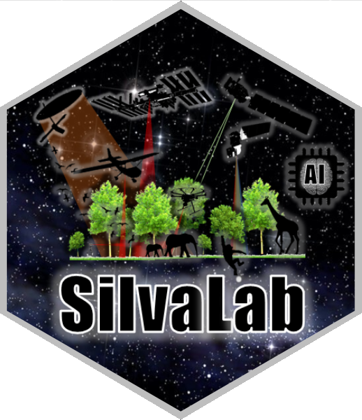

<p align="center"></p>

<p align="center">
<a href="https://www.python.org/"></a>
<a href="https://book.cryointhecloud.com/"></a>
<a href="LICENSE"></a>
<a href="https://github.com/Cesarito2021/pyNISAR/archive/refs/heads/main.zip"></a>
</p>

# pyNISAR: a Python library for accessing, screening, processing and downloading NASA–ISRO SAR data

**Author:** Cesar Alvites — University of Florida, School of Forest, Fisheries, and Geomatics Sciences.

pyNISAR searches NISAR observations, inspects HDF5 products, reads or downloads
selected data, and generates cross-polarization and polarimetric products for
applications such as forest monitoring. This research library focuses on **L-band
GSLC, GCOV and RSLC**, using code developed for [PyGeoObserver](https://github.com/Cesarito2021/pygeoobserver).

Its focus is a guided NISAR workflow: **define an area → search observations →
access or download data → generate polarimetric products → export maps and figures**.
This integrates data access and processing around established polarimetric methods.

## Configuration and account credentials

| Requirement | Configuration |
|---|---|
| Python | 3.11 or newer; local Jupyter, Colab or CryoCloud. |
| Source access | This repository is **private**; GitHub permission is required to download it. No PyPI release yet. |
| NASA credentials | Your own [Earthdata Login](https://urs.earthdata.nasa.gov/) for protected reads/downloads. Search and bundled examples need no login. |
| Study area | WGS84 box, GeoJSON or a GeoPackage polygon layer. |
| Storage | Choose a local/notebook output folder. Whole HDF5 scenes may occupy several GB; bounded remote reads avoid saving a complete scene. |

## Get started

Download and extract the source ZIP, then install from its folder:

```bash
python -m pip install ".[plot,discovery,notebook]"
```

The measured examples run immediately without NASA credentials:

```python
import pynisar
run = pynisar.process_sample("outputs", mode="dual")  # Or mode="quad".
figures = pynisar.plot_gallery(run)
```

**Colab/Jupyter/CryoCloud:** install from the extracted source, then copy the
cells below into a notebook. The existing [downloadable notebooks](examples/)
use the earlier workflow; this README presents the simplified steps.

## Introduction

[NASA–ISRO Synthetic Aperture Radar (NISAR)](https://science.nasa.gov/mission/nisar/)
uses L- and S-band radar to observe changes in land, vegetation, water and ice.
Launched on 30 July 2025, it supports ecosystem monitoring and studies of surface
change. pyNISAR currently processes the mission's **L-band** products.

Data-release status, checked **27 September 2026**:

- **23 January 2026:** initial pre-calibration sample products, Levels 1–3.
- **27 February 2026:** broader **BETA** release, not fully calibrated.
- **20 July 2026:** calibrated, partially validated **PROVISIONAL** products,
  Levels 0–3; routine acquisitions from 17 June 2026 plus selected earlier time series.
- **Planned for Q4 2026:** validated products and reprocessing of the science-phase
  backlog; this remains a schedule, not a completed release.

See the [NASA/ASF availability guide](https://nisar-docs.asf.alaska.edu/availability-overview/)
for updates. Avoid treating BETA and PROVISIONAL products as interchangeable.

## Input and output data

| Case | Input | Products | Figures |
|---|---|---|---|
| Dual polarization | HH/HV or VV/VH in GSLC/GCOV/RSLC; complex cross terms needed for phase descriptors | Measured powers, intensity ratios, supported H, α, DoP and related descriptors; GeoTIFF, CSV, manifest | Power maps and H–α density |
| Quad polarization | Measured HH/HV/VH/VV and complete complex covariance; explicit reciprocity assumption | Supported 18-layer profile, including H, A, α, span and Pauli powers; GeoTIFF, CSV, manifest | Power maps and H–A–α diagram |

Missing phase information is never reconstructed from intensity alone. RSLC
remains in radar geometry. Small-window runs also save covariance; chunked runs
avoid this extra storage. [Product definitions](docs/POLARIMETRY.md).

## Dual-polarization case

Run these cells in order after installation. This example searches a small
Great Lakes area, selects one observation and processes a bounded radar window.
Use your own NASA Earthdata account.

**Step 1 — Import libraries.**

```python
import earthaccess
import pandas as pd
import pynisar
from IPython.display import display, Image
```

**Step 2 — Define the study area.** Coordinates are west, south, east, north.

```python
bbox = (-90.215, 46.435, -90.185, 46.465)
center = (-90.2, 46.45)
```

**Step 3 — Sign in to NASA Earthdata.**

```python
auth = earthaccess.login(persist=False)
```

**Step 4 — Search NISAR.** Show the first six catalogue records.

```python
scenes = earthaccess.search_data(
    short_name="NISAR_L2_GSLC_PROVISIONAL_V1",
    bounding_box=bbox,
    temporal=("2025-11-06", "2025-11-07"),
    count=20,
)
pd.json_normalize(scenes)[["umm.GranuleUR"]].head(6)
```

**Step 5 — Select one scene.** Row 0 selects the first returned observation.
If the table is empty, change the area or dates before continuing.

```python
scene = scenes[0]
scene["umm"]["GranuleUR"]
```

**Step 6 — Generate products.** Read a 256 × 256 native-pixel window at the
study-area center. HTTPS range reads avoid saving the complete HDF5 scene;
the transfer limit is 256 MiB. Channel availability is checked during processing.

```python
url = scene.data_links()[0]
with pynisar.open_remote(url, max_mb=256) as source:
    run = pynisar.process(
        source, "outputs/dual",
        channels=["HH", "HV"],
        center=center, window_size=256,
        looks=(4, 2),
    )
```

**Step 7 — Inspect the products.** GeoTIFF layers, statistics and a processing
manifest are saved in the output folder.

```python
statistics = pd.read_csv(run / "statistics.csv")
statistics.head(6)
```

**Step 8 — Show the figures.** Display HH, HV and the polarimetric diagram.

```python
figures = pynisar.plot_gallery(run)
display(Image(filename=str(figures[0])))
display(Image(filename=str(figures[1])))
display(Image(filename=str(figures[2])))
```

**Existing measured example:** HH/HV selected from a quad GSLC acquisition,
6 November 2025, western Great Lakes. Power is uncorrected mean |S|²;
H–α uses the dual C2 basis. This is dual-channel analysis of a quad acquisition.

<table><tr>
<td width="33%" align="center"><strong>HH</strong><br></td>
<td width="33%" align="center"><strong>HV</strong><br></td>
<td width="33%" align="center"><strong>H–α · 2D</strong><br></td>
</tr></table>

## Quad-polarization case

Run these cells in order after installation. This example searches a small
Great Lakes area, selects one observation and processes a bounded radar window.
Use your own NASA Earthdata account.

**Step 1 — Import libraries.**

```python
import earthaccess
import pandas as pd
import pynisar
from IPython.display import display, Image
```

**Step 2 — Define the study area.** Coordinates are west, south, east, north.

```python
bbox = (-90.215, 46.435, -90.185, 46.465)
center = (-90.2, 46.45)
```

**Step 3 — Sign in to NASA Earthdata.**

```python
auth = earthaccess.login(persist=False)
```

**Step 4 — Search NISAR.** Show the first six catalogue records.

```python
scenes = earthaccess.search_data(
    short_name="NISAR_L2_GCOV_PROVISIONAL_V1",
    bounding_box=bbox,
    temporal=("2025-11-06", "2025-11-07"),
    count=20,
)
pd.json_normalize(scenes)[["umm.GranuleUR"]].head(6)
```

**Step 5 — Select one scene.** Row 0 selects the first returned observation.
If the table is empty, change the area or dates before continuing.

```python
scene = scenes[0]
scene["umm"]["GranuleUR"]
```

**Step 6 — Generate products.** Read a 128 × 128 native-pixel window at the
study-area center. HTTPS range reads avoid saving the complete HDF5 scene;
the transfer limit is 256 MiB. Channel availability is checked during processing.

```python
url = scene.data_links()[0]
with pynisar.open_remote(url, max_mb=256) as source:
    run = pynisar.process(
        source, "outputs/quad",
        channels=["HH", "HV", "VH", "VV"],
        center=center, window_size=128,
        looks=(1, 1),
        reciprocal=True,
    )
```

**Step 7 — Inspect the products.** GeoTIFF layers, statistics and a processing
manifest are saved in the output folder.

```python
statistics = pd.read_csv(run / "statistics.csv")
statistics.head(6)
```

**Step 8 — Show the figures.** Display HH, HV and the polarimetric diagram.

```python
figures = pynisar.plot_gallery(run)
display(Image(filename=str(figures[0])))
display(Image(filename=str(figures[1])))
display(Image(filename=str(figures[2])))
```

**Existing measured example:** four-channel GCOV from the same Great Lakes
acquisition. Power is used as stored (nominal γ⁰); H–A–α uses reciprocal Pauli T3.
The calculation explicitly assumes reciprocity.

<table><tr>
<td width="33%" align="center"><strong>HH</strong><br></td>
<td width="33%" align="center"><strong>HV</strong><br></td>
<td width="33%" align="center"><strong>H–A–α · 3D</strong><br></td>
</tr></table>

These figures were generated previously from measured data; the revised code
above has not been rerun in CryoCloud. Catalogue ordering or reprocessing can
change the selected scene. [Figure source records](docs/figures/panels/sources.json).
These examples are separate from the manuscript’s Amazon–Cerrado study area.

The search box selects scenes; the processing example reads a window at its
center, not the entire box. For a downloaded HDF5 and a GeoJSON/GeoPackage AOI,
use `process_tile(..., scope="aoi", aoi="study_area.geojson")` to mask products,
or `scope="tile"` for the whole tile. `process_batch(..., workers=1)` processes
files in chunks. Source deletion is optional and occurs only after successful
export. [Batch, parallelism and storage](docs/BATCH.md).

## Acknowledgments

This study was supported by NASA’s Carbon Monitoring System (CMS,
**80NSSC23K1257**), Commercial SmallSat Data Scientific Analysis (CSDSA,
**80NSSC24K0055**), and ICESat-2 (**80NSSC23K0941**); the National Science
Foundation’s OpenForest4D project (**Award 2409886**); the Joint Fire Science
Program (**22-2-02-15**, *EMS4D: Multi-Scale Fuel Mapping and Decision Support
System for the Next Generation of Fire Management*); and the McIntire–Stennis
Program at the University of Florida (**Accession 7005758**).

Cesar Alvites thanks **CryoCloud** for access to its Python/Jupyter environment,
supported by NASA grants **80NSSC22K1877** and **80NSSC23K0002**. Manuscript
processing was performed in **Google Colab**.
[CryoCloud acknowledgment guidance](https://book.cryointhecloud.com/citing-cryocloud).

We acknowledge [PolSARtools](https://github.com/polsartools/polsartools) and its
developers for their contribution to open polarimetric SAR processing and their
influence on this workflow. pyNISAR's core metric calculations use native
implementations; selected optional decompositions call **PolSARtools 0.11**.
See [metric definitions](docs/POLARIMETRY.md) and the citation below.

## Reporting issues

Please report pyNISAR issues to postdoctoral fellow **Cesar Alvites** at
[c.alvitediaz@ufl.edu](mailto:c.alvitediaz@ufl.edu), or open a
[GitHub issue](https://github.com/Cesarito2021/pyNISAR/issues).

## Citation

Alvites et al. *Early assessment of NISAR L-band SAR and multi-sensor fusion for
aboveground carbon mapping in the Brazilian Amazon–Cerrado ecotone.*
**Remote Sensing Applications: Society and Environment (under review).**
Not yet published; no publication DOI is assigned.
[Full author list and software citation](CITATION.cff).

When using the optional PolSARtools-based decompositions, also cite:

Bhogapurapu, N., Siqueira, P., & Bhattacharya, A. (2026).
*polsartools: A Cloud-Native Python Library for Processing Open Polarimetric SAR
Data at Scale.* **SoftwareX, 33**, 102490.
[doi:10.1016/j.softx.2025.102490](https://doi.org/10.1016/j.softx.2025.102490).
The original references for the polarimetric methods used should also be cited.

## Disclaimer

pyNISAR is provided as research software without warranties of accuracy,
fitness for a particular purpose, or uninterrupted operation. Users are
responsible for assessing its suitability and validating their results. To the
extent permitted by applicable law, the authors are not liable for loss or damage
arising from its use. pyNISAR is not an official NASA or ISRO software product.

## License

**GNU General Public License v3.0 only (GPL-3.0-only)**, matching PyGeoObserver.
See [LICENSE](LICENSE) for the terms and [provenance](docs/PROVENANCE.md) for credits.

## Repository statistics

[GitHub traffic](https://github.com/Cesarito2021/pyNISAR/graphs/traffic) shows
views, unique visitors, and clones for the last 14 days (repository access required).
GitHub does not provide lifetime unique visitors or visitor countries.

Clones are not a complete download count. Files explicitly uploaded to GitHub
Releases have separate download counters; source ZIP downloads and library
installs are not included. [Details](docs/TRAFFIC.md).

<table>
<tr>
<td align="center" width="20%"></td>
<td align="center" width="20%"></td>
<td align="center" width="40%"></td>
<td align="center" width="20%"></td>
</tr>
</table>

Logos identify acknowledged organizations and affiliations; they remain the
property of their respective owners and do not imply endorsement of pyNISAR.
